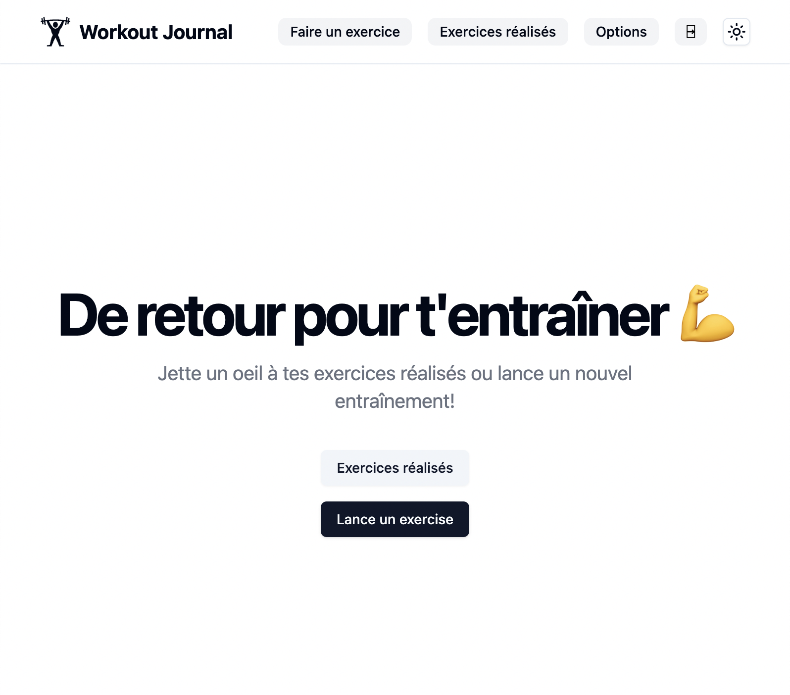

# Workout Journal 🏋️‍♂️ - by Julien THOMAS ~ Frontend

### [Want to track your progress?](https://workout-journal-pro.netlify.app/) 💪

# ⚡️ Introduction

A React app to track your progress at the gym for specific exercises.

# 🔥 Features

💬 **Add/Update/Delete your exercise**  
🌙 **Dark Mode**  
📲 **Responsive**  

# ⚙️ Behind the scene

🖊️ **Typescript language**  
✨ **Tailwind project**  
🧩 **Radix primitive components**  
📂 **Use separate backend**  

---

# 🌐 Credits

- Shadcn : [Website](https://ui.shadcn.com/)
- Workout Journal Backend : [GitHub Repo](https://github.com/doncarlo5/workout-journal-backend)
